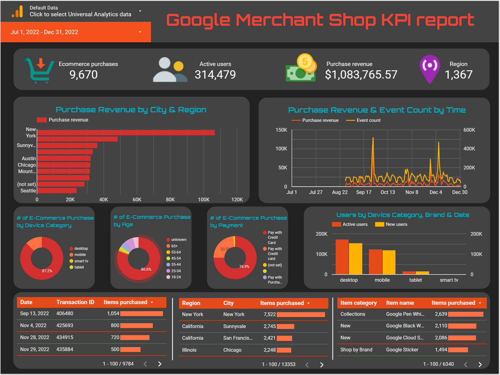

# A4SM-Looker-Studio-Dashboard

## How to Access the Dashboard
You can access the dashboard using the following link:
[Looker Studio Dashboard](https://lookerstudio.google.com/reporting/9ab38d41-b795-4b63-a0b7-3dc934b9e9b9)

## Introduction
This project involves creating a customizable and functional dashboard using Looker Studio. The goal is to present data in an appealing and easily understood manner, enabling decision-makers to evaluate strategic and operational effectiveness. The dashboard focuses on key performance indicators (KPIs) to track and analyze business performance.

## Objectives
The primary objectives of this project are:
- To create a customizable dashboard in Looker Studio.
- To select and visualize key performance indicators (KPIs) relevant to business success.
- To provide actionable insights through data visualization and analysis.

## Data Source
The dashboard utilizes data from `Google Merchant Shop`. This data source provides comprehensive information about online shopping activities, including sales, user behavior, and transaction details.

## Dashboard Navigation
- **Controls**: Users can select the data source and date range using controls at the top left corner.
- **Drill Up/Down**: Users can view data from different dimensions by clicking the drill up or down buttons on each plot.
- **Sort and Export**: Users can sort data by various metrics and dimensions, and export charts using the options provided.

### Dashboard Screenshot
Here is the screenshot of the dashboard:

